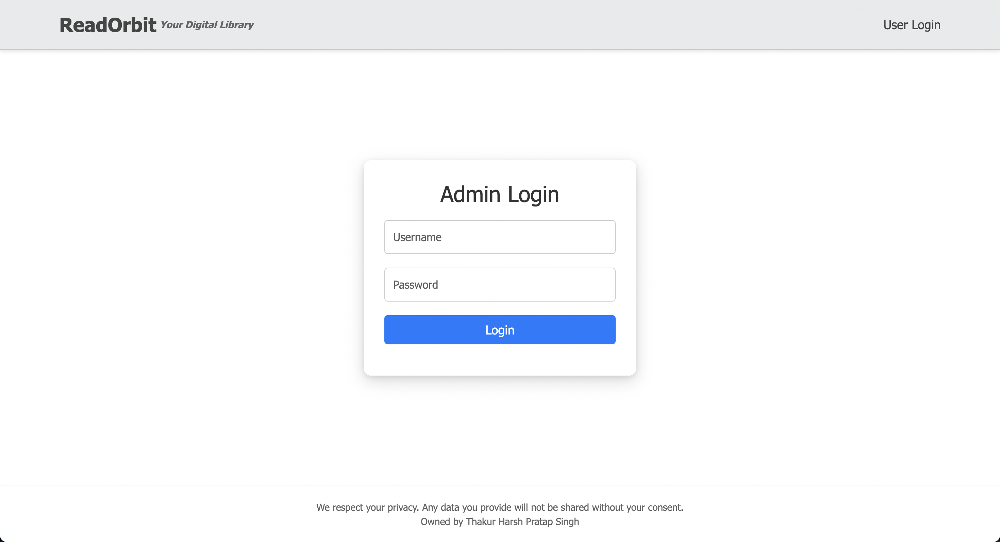
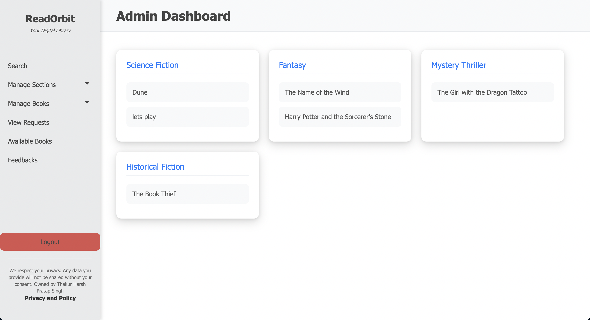
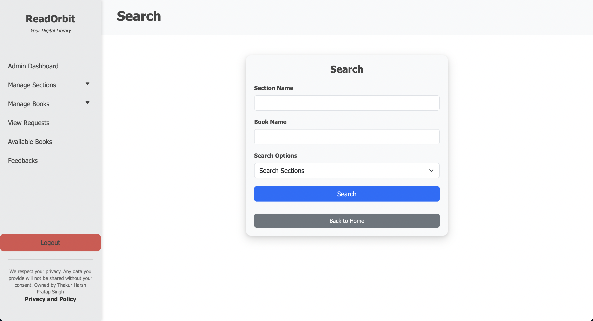

# ReadOrbit Library Management System

## 📚 Overview

ReadOrbit is a comprehensive web-based Library Management System developed as part of the Modern Application Development 1 course at IIT Madras BS Degree program. This multi-user web application enables efficient e-book management, allowing users to browse, request, and access digital books while providing administrators with robust tools for catalog management.
**Project Grade: S (10/10)**

## ✨ Features

### User Features
- **Account Management**: Secure registration and login system
- **Book Discovery**: Browse books by categories and search functionality
- **Book Requests**: Request e-books from the library catalog
- **Feedback System**: Provide ratings and reviews for books
- **User Dashboard**: Track requested and borrowed books

### Admin Features
- **Catalog Management**: Add, update, and remove books from the library
- **User Management**: View and manage user accounts and privileges
- **Section Organization**: Create and manage book categories/sections
- **Request Processing**: Approve or deny book requests
- **Analytics**: Basic usage statistics and reports

## 🛠️ Technology Stack

- **Backend**: Flask (Python web framework)
- **Frontend**: HTML, CSS, Bootstrap, Jinja2 Templates
- **Database**: SQLite with Flask-SQLAlchemy ORM
- **Authentication**: Custom login framework with password hashing
- **Deployment**: Local development server

## 📊 Database Schema

The application uses a relational database with the following models:

- **User**: Stores user information and authentication details
- **Admin**: Separate table for administrator accounts
- **Book**: Contains metadata about available e-books
- **Section**: Represents book categories or genres
- **Book_in_section**: Junction table for mapping books to sections
- **Requested_book**: Tracks book requests from users
- **Feedback**: Stores user ratings and reviews

Key relationships:
- Feedback has relationships with User and Book
- Book has relationship with Requested_book
- Separate tables for Admin and User authentication

## 🖼️ Screenshots

### Home Page


### Admin Dashboard


### Book Catalog


## 🚀 Installation and Setup

1. **Clone the repository**
   ```bash
   git clone https://github.com/yourusername/ReadOrbit.git
   cd ReadOrbit
   ```

2. **Set up a virtual environment**
   ```bash
   python -m venv venv
   source venv/bin/activate  # On Windows: venv\Scripts\activate
   ```

3. **Install dependencies**
   ```bash
   pip install flask
   pip install flasksqlalchemy
   ```

5. **Run the application**
   ```bash
   python mai.py
   ```

6. **Access the application**
   - Open your browser and navigate to `http://127.0.0.1:5000`

## 👨‍💻 Project Author

- **Name**: Harsh Pratap Singh
- **Roll No.**: 22f3002166

## 🎥 Demo

View a demonstration of the application's features:
[Watch Demo Video](https://drive.google.com/file/d/1JfK9resY06e34pfrZRd3g5ky-45Hu1tI/view?usp=drive_link)

## 📄 License

This project is licensed under the MIT License - see the [LICENSE](LICENSE) file for details.

## 🙏 Acknowledgements

- IIT Madras BS Degree Program
- Modern Application Development 1 course instructors
